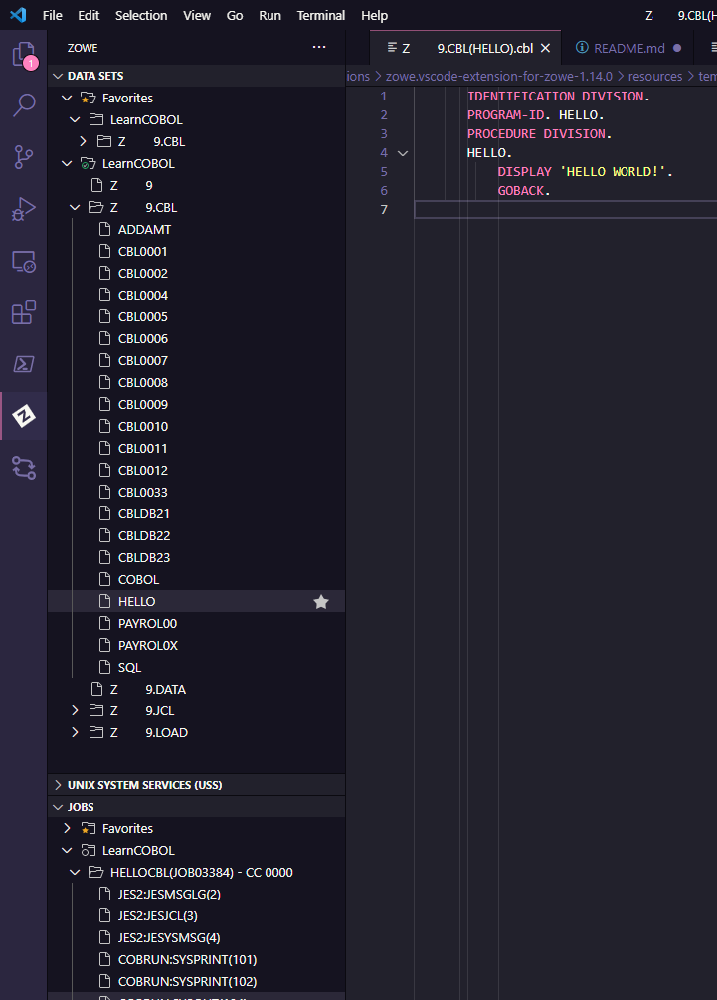
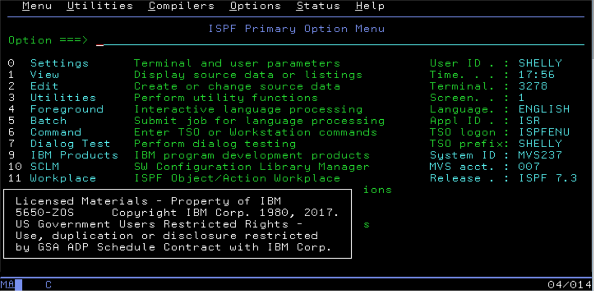

# Hello `COBOL`

While going through my daily routine of digging through the tech links I stumbled upon this video: [COBOL Course - Programming with VSCode](https://www.youtube.com/watch?v=RdMAEdGvtLA)... and since my knowledge of COBOL was mostly based on jokes or anecdotes I thought to myself "sure, I can spend an hour and seventeen minutes of my time to learn something and perhaps be less biased about one of the most famous programming languages". 

Oh little did I know what a rabbit hole this was...

13 minutes into the video I'm beginning realize something is missing.... yeah, the lab mentioned in the video is missing (the video was part of the longer course), so to get somewhat familiar with COBOL I'll have to look further... Quick look at the description sends me to the [course GitHub page](https://github.com/openmainframeproject/cobol-programming-course). The course was prepared by IBM, but is part of the [Open Mainframe Project](https://www.openmainframeproject.org/) managed by the [Linux Foundation](https://www.linuxfoundation.org/).

The topmost entry in the repository is called *"COBOL Programming Course #1 - Getting Started"*? - great, that is exactly what I'm looking for! ...I still do not get a hint when I open the 122 page PDF on "getting started". Trying to get to the practical bits I'm skimming through first few pages describing how COBOL awesome and is being used everywhere... Did you know that every day there are 200 times more COBOL transactions executed than there are Google searches? Me neither, let's move on... 

The guide mentions two extensions I will need to get to begin working with the code. The first one being "Zowe Explorer" it *allows for platform access to the mainframe using VSCode...* wait, what? Am I supposed to get a mainframe now? Well technically yes, but that's going to be "easy" - IBM is providing free 180 day  environment access for the purpose of the lab, so all I had to do is [to register](http://ibm.biz/cobollabs). Once I got my username and had a short conversation with Zih, the Slack bot that reset my password I was all set! I followed the instructions in the training materials to set up Zowe Explorer profile in VSCode and *voila* I was able to explore the `data sets` and `jobs`. 

This made me wonder why all this hassle, can't I just log in to the lab and work from there? And the answer is *I probably could*, however I did not realize how different interacting with mainframe is in comparison to for instance Linux, so the Zowe's purpose is to bridge a gap between the modern tools and the mainframe interface. How different can it be? One may ask... well... actually quite a lot... [Here is a nice video](https://www.youtube.com/watch?v=UAimEqwiUH0) showing how to perform common Linux commands on z/OS. In short the primary interactive interface to the operating system is menu based:

---
References

1. [z/OS for Linux folks - M116](https://www.youtube.com/watch?v=UAimEqwiUH0)
2. [Turn your laptop into a portable mainframe](https://oofhours.com/2019/09/17/turn-your-laptop-into-a-portable-mainframe/)
3. [Using command line to interact with z/OS](https://ibm.github.io/zopeneditor-about/Docs/interact_zos_cli.html#comparison-between-zowe-cli-and-rse-cli-plug-in)
4. [COBOL Course - Programming with VSCode](https://www.youtube.com/watch?v=RdMAEdGvtLA)
5. [RPF: Rob's Programming Facility](http://www.prince-webdesign.nl/rpf)
6. [IBM Public Domain Software Collection](http://www.ibiblio.org/jmaynard/)
